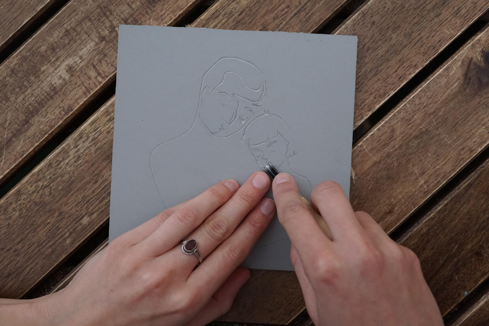
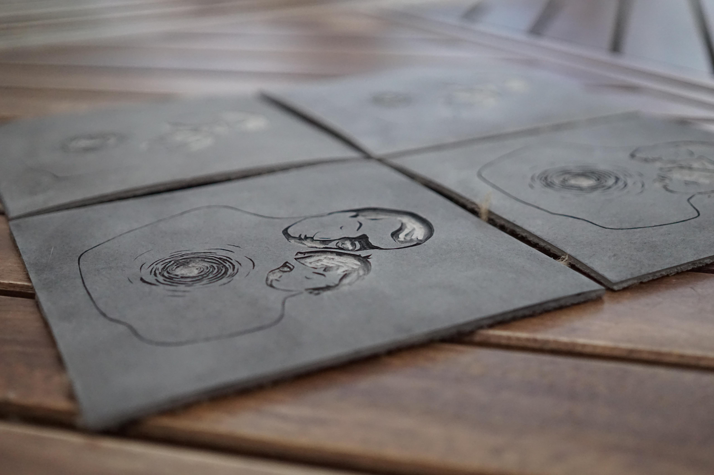
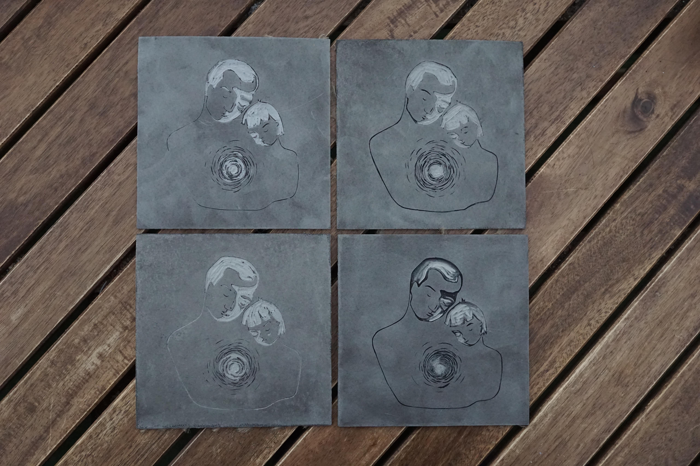
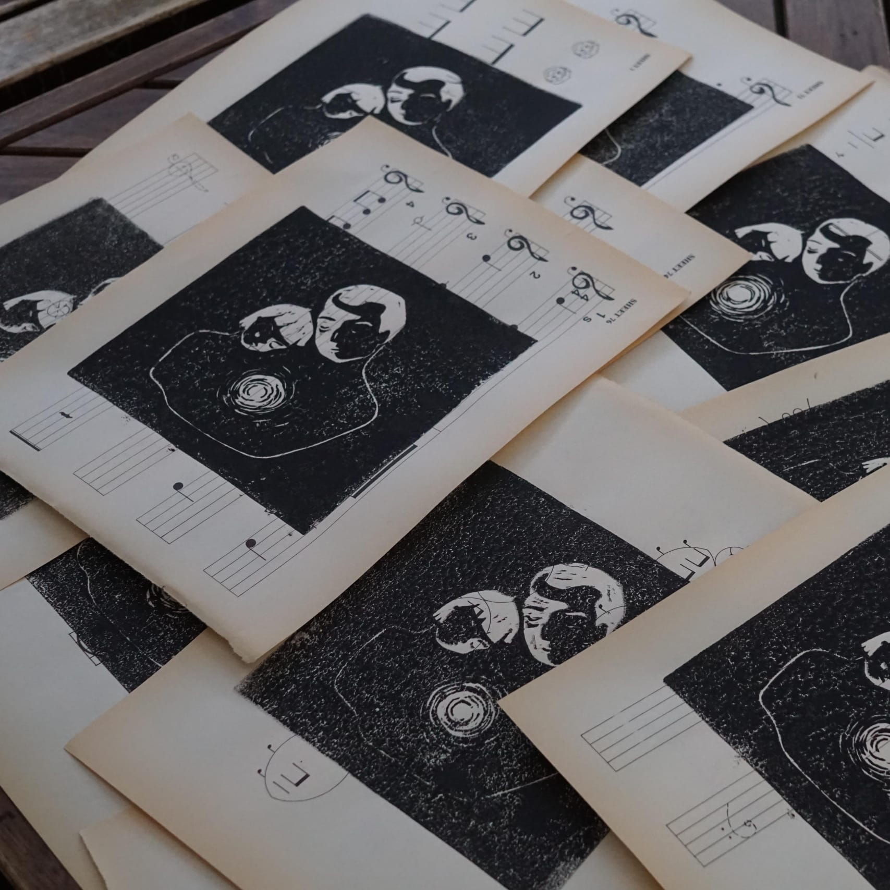

After I carved four linocuts, I printed it on an old music training book found in an op shop. Here the final result.

<video src="animation.MP4" controls width="800"></video>

Pictures of the process:

