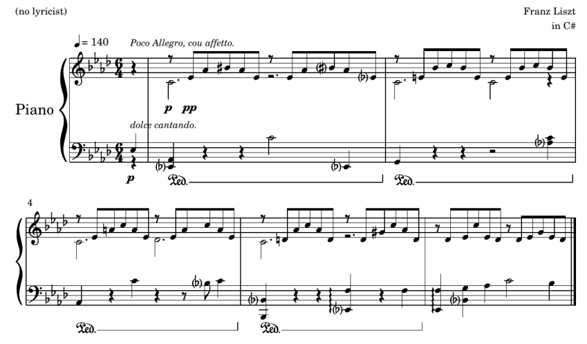
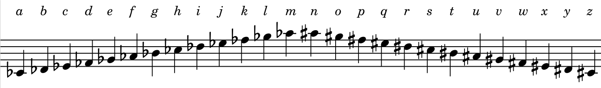

## Introduction

In november 1940 in France, the Vichy Government installs the *Service des Contrôles Techniques* in charge of watching French people through their letter correspondences. Eve, an employee of the SCT opens an envelop and finds a letter with a music sheet attached.
 
> My Dearest Bob, \
> I would be glad if you could share with me your thoughts about the music I wrote. \
> Yours always, \
> -- <cite>Alice</cite>

##### Figure 1 : The five first modified measures of the piece Liebesträume composed Liszt.

---

She quickly glances at it, closes it and classifies it as *non sensitive letter*, and stacks it on the corresponding pile in order to send it to Bob as Alice expected. 

Once Bob receives it, he follows the rule that he agreed with Alice. He reads all notes preceded by a sharp or flat symbol, then converts it to a letter of the latin alphabet according to the following decoding table:

##### Figure 2 : The key to decode the message.

Stacking all those letters in the order of appearance in the sheet (from left to right, both of staves at the same time) leads to the decoded message '*attack leave*'. As soon as Bob discovers it, he understands that his security is at stake and immediately leaves for another shelter.

##### Figure 3 : The solution.

This fictional example illustrates the concept of *steganography* and *steganalysis*. Alice and Bob perform steganography, as Alice hides a message in a content. Here, she modifies an existing music sheet according to a method they agreed beforehand with her accomplice Bob. On the other side, Eve, the employee of the SCT, performs steganalysis. She wants to block any secret messages transmitted between citizens. 

Since the formal definition of the prisoners' problem by Simmons in 1983, steganography and steganalysis have been considered as a *hide and seek* game.

The prisoners’ problem tells the story of Alice and Bob, two prisoners working on an escape plan. They are allowed to communicate, but their communications pass through the warden, Eve. Eve will attempt to find any hidden communication between Alice and Bob, and if she finds one, she will cut the communication channel.

## Definition of concepts

**Steganography** is the art of dissimulation. When *Alice* wants to communicate a secret message to *Bob*, steganography consists in hiding a message in a *content*, while Alice and Bob previously shared the decoding method. There are illimited possibilities for the nature of the content as long as it looks legitimate: it could be a music sheet or a poem, an image... 

**Steganalysis** is the adversarial act of detecting if a message has been hidden in a content. *Eve*, as in the expression *eavesdropping*, wants to stop Alice and Bob to keep secrets from her. She has the power to cut the communication channel between the two of them, which encourages them to be the least suspicious as possible.

History is full of amusing anecdotes about past usages of steganography. To our knowledge, the first utilization goes back to ancient Greece. In the book *Histories* written by Herodotus, Histiaeus tatooes a secret message on the skull of a slave. The messenger goes undercover when his hair grow back, and the message is decoded by Aristogoras by simply shaving him.

Another famous use of steganography is writing using invisible ink on regular paper. The ink can be made of lemon juice, and the message can be read by exposing the paper to a source of heat.

<!-- 

\vspace{1em}

In this thesis, we will limit ourselves to a particular type of content: digital images. The next section aims at introducing the image format, before explaining how to apply steganography in images.

\section{Image representation}

\subsection{From photons to digital data}

Photography, which means etymologically ``coloring with light'' is the ambitious challenge to convert into an object the environment which created a physical sensation in a human. This technique is more than common today, as it is part to our daily lifes as all of our smartphones can take pictures. But until last century, photography was not common and it required a lot of technological and scientific progress. 

\begin{marginfigure}
\includegraphics[width=\linewidth]{images/spectrum.pdf}
\caption{Normalized response of the three cones S, M, L of the human eye~\cite{stockman2000spectral} (top) and of the three color channels of a Nikon D700 device~\cite{mauer2009measuring} (bottom).}
\label{app:fig:spectrum}
\end{marginfigure}

It exists two major technologies of photographic sensors: CCD (Char-Coupled Device) and CMOS (Complementary Metal Oxide Semiconductor) using photoelectric effect. It quantifies the number of photons hitting a photographic cell array in order to translate it to numerical data.

In order to reproduce colored photography, researchers first looked for the biological composition of a human eye. It is in 1802 that Young discovered~\cite{young1948theory} that it exists three types of photoreceptors (now known as cone cells) in the human eye, each of which are sensitive to a particular range of visible light, which where called short, medium or large given their size. 

A few years later, Maxwell demonstrated theoretically in 1855~\cite{MaxwellXVIIIEO} that any monochromatic light stimulating three receptors should be able to be equally stimulated by a set of three different monochromatic lights. This would mean that every sensation of color could be reproduced by a superposition of three colors, therefore called \textit{primary colors}. The first color photography was therefore produced by taking picture three times of the same scene with three colored filters. 

Today, representation of color digital images still relies on the superposition of three color channels which are red, green and blue, so three type of tensors are used. Figure~\ref{app:fig:spectrum} shows both absorption spectrums of receptors in the eye and in a Nikon D700 look alike.

% The first three colorless photographs were obtain through of monochromatic photographic of the same scene were taken through red, green and blue filters, then were printed on their complementary color so that the superposition of the three would reproduce the original scene (given the theory of subtractive colorimetry).

In order to take at one instant a picture with three kind of photoreceptors, the most common solution is to use a color filter array (CFA). It is a mosaic of tiny color filters placed over the pixel sensors of an image sensor to capture color information.  Multiple subjective designs of the CFA exists. The most  popular one is the Bayer Filter, plotted on Figure~\ref{fig:bayer}.

\begin{marginfigure}
\includegraphics[width=\linewidth]{images/bayer.pdf}
\caption{The Bayer CFA. Each two-by-two submosaic contains 2 green, 1 blue, and 1 red filter, each filter covering one pixel sensor.}
\label{fig:bayer}
\end{marginfigure}

The raw image data captured by the image sensor is then converted to a full-color image (with intensities of all three primary colors represented at each pixel) by a demosaicing algorithm which is tailored for each type of color filter. 

Gray scale images are coded only with one channel. It contains the luminance $Y$, which is equal to a linear combination of the three color channels $R,G$ and $B$:

\begin{equation}
Y = 0.299R + 0.587G + 0.114B
\label{eq:luminance}
\end{equation}

\begin{figure*}
\includegraphics[width=\linewidth]{images/imagecolor.pdf}
\caption{Three colors (left) channels, which when superposed produce a color image (fourth image). The last image is the luminance computed with Equation~\ref{eq:luminance}.
}
\label{fig:imagecolor}
\end{figure*}  -->

