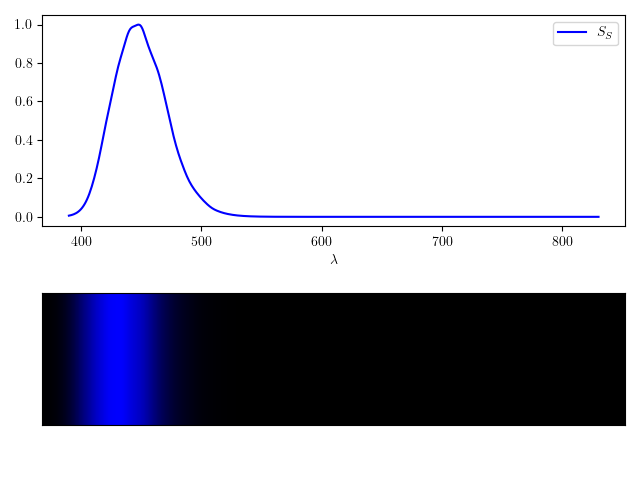
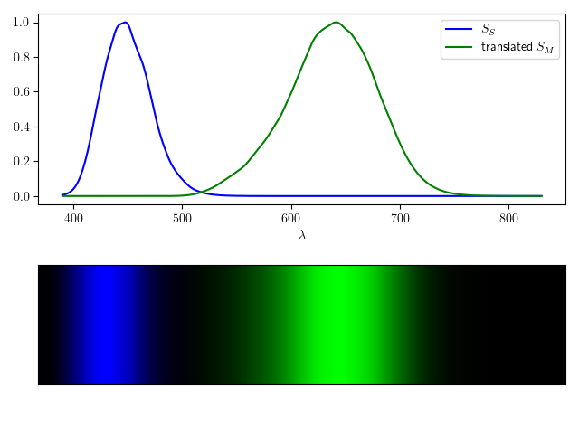
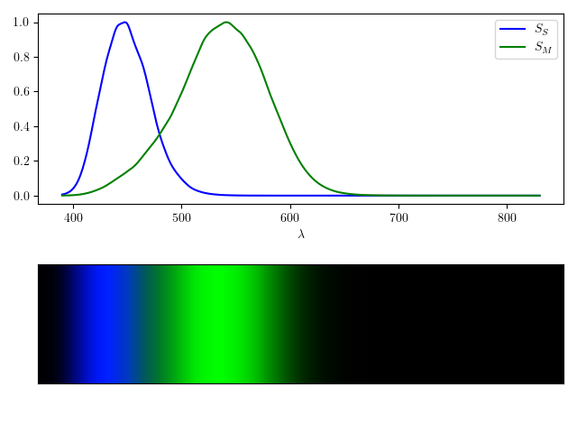

## Introduction

Recently, I read an article claiming that the color pink doesn't exist, and is only an illusion from our brain. Because I struggle to accept this idea, this is the motivation into diving in the understanding of the human perception of colors. 

### Cones 

The perception of light is due to photoreceptors cells, called cone and rod cells. Rod cells gives low intensity light perception, and cones cells gives high intensity light perception. Most humans have three kinds of cones, each sensitive to a different spectrum of lights, and the combination of those three signals analyzed by our brain gives the sensation of color.

From data collected from http://cvrl.ucl.ac.uk/cones.htm , we can plot the different sensitivy of those three cones, sensitives to either small ($S_S$), medium ($S_M$) or long ($S_L$) wavelenghts.

##### Figure 1 : Normalized cone sensitivy to light 

#### Cones responses to any light spectrums

For each wavelength $\lambda$, the contribution to the cone's response is the product of the light's intensity $I(\lambda)$ and the cone's sensitivity $S(\lambda)$ at that wavelength.

<!-- 
Mathematically: $R = \int I(\lambda) S(\lambda) \, d\lambda$, where:
+ $R$ is the total cone response,
+ $I(\lambda)$ is the intensity of the light at wavelength $\lambda$,
+ $S(\lambda)$ is the sensitivity of the cone to that wavelength.

If the light consists of discrete wavelengths (e.g., lasers or narrowband sources), you can sum the contributions from each wavelength:

$$ R = \sum_{i} I(\lambda_i) S(\lambda_i),$$

where $I(\lambda_i)$ and $S(\lambda_i)$ are the intensity and sensitivity at each discrete wavelength $\lambda_i$. -->

So the sensation of color is *encoded* by the triplet $\mathbf{r} = \{r_{S},r_{M},r_{L}\}$ corresponding to the response to each cone. It is reasonable to assume that two different triplets will give different colors, and equivalently two same triplets will give the same color. 

## The space of possible cone responses 

Let's name $\mathcal{R} = \{\mathbf{r}\}$ the set of all possible triplets. We could think that set of triplets are in a cube of size $1$, but because the three sensitivy curves overlap, the responses of cone are dependant of each other. Let's first observe the set of responses corresponding to a monochromatic stimulus.

### Space of monochromatic stimulus

##### Figure 2 : Response to monochromatic stimulus

First let's inspect all possibles cones responses to monochromatic stimulation. We can plot on a 3D axis the values $\{r_S, r_{M},r_{L}\}$ with 
+ $r_S = S_S(\lambda)$
+ $r_M = S_M(\lambda)$
+ $r_L = S_L(\lambda)$
with $\lambda \in \[ 400 nm, 800 nm\]$. Let's call this set $\mathcal{R}_{mono}$

##### Figure 3 : The set of possible triplets of responses to monochromatic stimulus. On the left, the color shows the different lambda values (see the colorbar). On the right, the color is coded by the triplet $(r_l, r_m, r_s)$.

It's interesting to see that every distinct $\lambda$ will give another triplet (therefore another color). In fact, the condition to distinguish all different monochromatic lights (within a visible bandwidth) is to have at least three disctinct cones, and that the three overlap! (*add section to explain*).

### Space of all responses

An amazing feature with having three cones is that the range of colors perceived is bigger than the one provoked by monochromatic lights. I think the observation "the color pink doesn't exist" comes from this statement: pink is a color that is felt only via a **combination of monochromatic lights**. For the same reason, we could also say that white doesn't exist!

Because we assume that
+ any spectrum can be written as a distribution $I(\lambda)$ 
+ the sensitivy function is a linear mapping 
+ the maximum of sensitivy is reached by monochromatic stimulations,
  
the set of all possible triplets is equal to the **convex hull** $\mathcal{R}$ generated by the set $\mathcal{R}_{mono}$.

##### Figure 4 : Convex hull generated by the set $\mathcal{R}_{mono}$.

Even if any color is only an interpretation of the brain and we could argue that no color *exist*, we could keep this terminology to describe colors that are produced after a monochromatic stimulation. Following this definition, *existing* colors are the one in $\mathcal{R}_{mono}$, and the other existing colors are stricly inside the convex hull.

## Normalization of the color space

## Reproducing the sensation of color via RGB leds

## Appendix: minimal number of cones for monochromatic light distinction

To be able to see every monochromatic light as a different color, and if we assume that every cone sensitivy has a shape similar to a gaussian curve (increasing then decreasing), we can understand why one cone is not enough. We need a bijection between $\lambda$ and $S(\lambda)$.

##### Figure A.1 : Vision with one cone

##### Figure A.2 : Vision with two non-overlapping cones 

##### Figure A.3 : Vision with two cones

