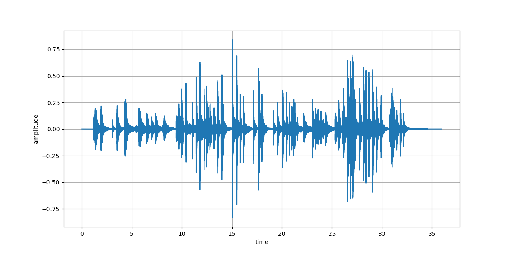

## Introduction

Inspired from my signal analysis teacher at uni, who is also passionated with music (he is a keen oboe player!), I wanted to code a simple algorithm to analyze the notes in a music piece. The pitch of each note is defined by a frequency $f$. For example, the most common tuning fork gives a A at frequency $440$Hz. Fourier decomposition is a very efficient mathematical tool: it shows the different frequencies present in a signal. We suppose that we record an instrument, like a piano, where different notes are played consecutively. 

We suppose that each note are played on a *twelve-tone equal temperament* keyboard. That means that the octave is divided into 12 parts which are equally spaced on a logarithmic scale. 

##### Figure 1 : 12-tone equal temperament chromatic scale on C


From a first note A defined by the frequency $f_0 = 440$Hz, the other notes are defined by:
$$ f_i = f_0 \sqrt[12]{2}^i $$

My method works in three steps: 
- smooth the temporal signal in order to detect the moment where the notes where played
- apply Fourier transform to each note individually
- find the fundamental frequency and convert it to a note. 

---

## Diving into the temporal signal

Here the music I recorded:

##### Audio: Piano impro
<audio src="jazz_nocturne_theme.mp3" controls></audio>

Let's analyze the signal! 

##### Figure 1 : Temporal signal


If we zoom into the time axis, we can observe something close to a sinusoidal signal:

##### Figure 2 : Zoom into the time signal


---

## First step: Detect the moment where the notes where played 

##### Figure 3 : Spectrogram of the song. 


From the spectrogram, we can compute a smoothest version of the temporal signal which makes the detection of the note easy by a *scipy* function *detect_peaks*.

##### Figure 4 : Smooth version of the time signal, and the red vertical lines correspond to detected notes.


```
# Import functions
import numpy as np
import matplotlib.pyplot as plt
from scipy.fft import fft, ifft, fftfreq
from scipy.signal import spectrogram, find_peaks

# Compute the spectrogram and sum
f, t, Sxx = spectrogram(y, fs, nperseg=2**9)
enveloppe = Sxx.sum(axis=0)

# Detect the timestamps of the note
ind, descr = find_peaks(enveloppe, width=1, height=5e-5)

# Plot
plt.figure(figsize=(15,4))
plt.plot(t, enveloppe, label='Temporal signal') # temporal signal
for num_i,i in enumerate(ind): # the peaks
    plt.plot([t[i],t[i]], [0,descr['peak_heights'][num_i]], c='red')
plt.show()
```

---

## Second step: Apply Fourier transform

Then we can apply for each interval apply a fast fourier transform to find which frequencies are present in this temporal signal. Then we can detect again the peaks and choose the highests as being the main harmonic. 

##### Figure 3 : (Top) The extracted temporal signal corresponding to a note detected in the song. (Bottom) The corresponding Fourier transform of the signal. The highest peak is detected at $f=1575$. The other two peaks at higher frequencies correspond to the higher harmonics $2f$ and $3f$.


```
# Enumerate trough the peaks (the detected notes)
for num_i,i in enumerate(ind):
    t_min, t_max = t[descr['left_bases'][num_i]], t[descr['right_bases'][num_i]]
    if t_max-t_min<2: # check that the one is shorter than 2 secs

        # Subset 
        small_t, small_y = t_axis[(t_axis>=t_min)&(t_axis<=t_max)], \
            y[(t_axis>=t_min)&(t_axis<=t_max)]
        
        # FFT
        N = len(small_t)
        yf = fft(small_y)
        yf = 2.0/N * np.abs(yf[0:N//2])
        xf = fftfreq(N, 1/fs)[:N//2]

        # Detect the peaks in the spectrum
        peaks, _ = find_peaks(yf, distance=10, width=1)

        # Choose the highest peak
        index_maxi = np.argsort(yf[peaks])[-1]
        f = xf[peaks[index_maxi]]
        index_note = quantize_f_to_note(f)
        print(f, index_note, liste_notes_letter[index_note%12])
```

```
liste_notes_letter = ["A", "A#", "B", "C", "C#", "D", "D#", "E", "F", "F#", "G", "G#"]
```

---

## Third step: Find the frequency then the note

We can inverse the formula presented earlier

$$ f_i = f_0 \sqrt[12]{2}^i $$

and find back which note $i$ is defined by frequency $f$:

$$ i = round(12 \log_2(\frac{f}{f_0})) $$

```
def quantize_f_to_note(f):
  # Input frequency f (Hz)
  # Ouput integer. 0 is A 440Hz, -1 is the Ab under, and 1 is A# above.
  return(np.round(12*np.log(f/440)/np.log(2)).astype(int))
```

---

## Results

| Time     | Frequency | Notes |
| -------- | --------- | ------ |
| 1.21  | $250    |
| 1.30 | $80     |
| March    | $420    |
