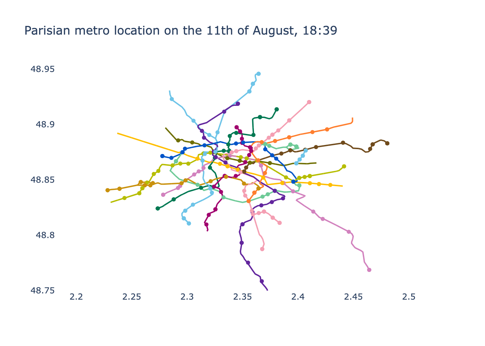

RATP, the parisian transportation company gives in [open data](https://data.iledefrance-mobilites.fr/) details about live traffic, including 

##### Live metro location
<!-- <iframe src="metro_map.html" width="8000" ></iframe> -->
