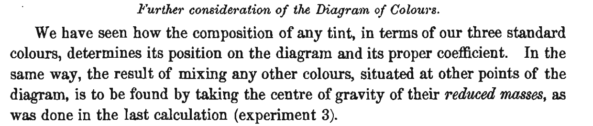

## Introduction

### What is photography

Photography, which means etymologically "describing with light” is the ambitious challenge to convert into an object the environment which created a physical visual sensation in a human.
This technique is more than standard today, as it is part of our daily lives as all of our smartphones can take pictures. However, until the last century, photography was not ordinary, requiring considerable technological and scientific progress.

## The foundation of colour theory

### Newton's pioneer work

Isaac Newton’s work on colour was groundbreaking in the 17th century — he was the first to show, through systematic experiments, that white light is composed of many different colours, and that colours are a property of light itself, not of objects. Newton devised one of the first colour circles, arranging spectral colours around a wheel and showing that mixing certain pairs (e.g., red and blue) could produce others (e.g., purple), which do not appear in the spectrum. He also noted that mixing all spectral colours in proper proportions yields white.

##### The first colour wheel: Newton's colour circle

### Young's speculation on the biology of the eye

It is in [1802 that Young boldly claims](https://www.jstor.org/stable/pdf/107113.pdf "The Bakerian Lecture: On the Theory of Light and Colours") that it exists three types of photoreceptors (now known as cone cells) in the human eye, which he named *point of the retina*, each of which are sensitive to a particular range of visible light, which are today called named short, medium, or large given their size. It came more from speculation following Newton's work than a experiment showing it. Young wrote in *The Bakerian Lecture: On the Theory of Light and Colours*:

> Now, as it is almost impossible to conceive each sensitive point of the retina to contain an infinite number of particles each capable of vibrating in perfect unison with every possible undulation, it becomes necessary to suppose the number limited, for instance, to the three principal colours, red, yellow, and blue, of which the undulations are related in magnitude nearly as the numbers 8, 7, and 6.

### Maxwell's experiment and first photography protocol

A few years later, inspired from Young's work, [Maxwell demonstrated theoretically in 1855](https://www.jimworthey.com/archive/Maxwell_1855_OCRtext.pdf "Experiments on colour, as perceived by the eye.") that any monochromatic light stimulating three receptors should be able to be equally stimulated by a set of three different monochromatic lights. 
##### Quote from Experiments on colour, as perceived by the eye.

Inspired by Mayer and Young's triangle, he formalized he statement by showing that he can reproduce the sensation of any colour by combining with different factors three colors U,V, and EG which stands for Ultramarine, Vermilion and Emerald Green, represented at the angles of an equilateral triangle. Any colour compounded of these three is to be represented by a point found by conceiving masses proportional to the several components of the colour placed at their respective angular points, and taking the centre of gravity of the three masses.

##### (Left) The color triangle of Tobias Mayer was the first formal treatment of the principle, known to artists and dyers, that all colors can be produced by mixing three pigments. (Right) Maxwell's triangle, where U,V and EG.

 

This would mean that a superposition of three colours could reproduce every sensation of colour, therefore called primary colours. Therefore, the first colour photography was produced by following Maxwell's protocol, by taking pictures three times of the same scene with three coloured filters.

##### The first color photograph made by the three-color method suggested by James Clerk Maxwell in 1855, taken in 1861 by Thomas Sutton. The subject is a colored ribbon, usually described as a tartan ribbon.

### Digital photography

Two dominant photographic sensors exist: CCD (Charge-Coupled Device) and CMOS (Complementary Metal Oxide Semiconductor) using the photoelectric effect. It quantifies the number of photons hitting a photographic cell array to translate it to numerical data. 

Today, the representation of colour digital images still relies on the superposition of three colour channels: red, green, and blue, so three types of sensors are used. Figure 1.1 shows both absorption spectrums of receptors in the eye and in a Nikon D700 camera look alike.
In order to take at one instant a picture with three kinds of pho- toreceptors, the most common solution is to use a colour filter array (CFA). It is a mosaic of tiny colour filters placed over the pixel sensors of an image sensor to capture colour information. Multiple subjective designs of the CFA exist. The most popular one is the Bayer Filter, plotted in Figure 1.2.

The raw image data captured by the image sensor is then converted to a full-colour image (with intensities of all three primary colours represented at each pixel) by a demosaicing algorithm which is tailored for each type of colour filter.
Gray scale images are coded only with one channel. It contains the luminance Y , which is equal to a linear combination of the three color channels R, G and B:

$Y = 0.299R + 0.587G + 0.114B$

### What is our perception of sound?

We can start by a straightforward observation: humans have the sensation of *sound frequency*. When we hear a music, we hear the pitch, which corresponds to a frequency: what we call a melody is a sequence of sounds with a pitch changing over time. Human created a music system by associating notes to specific range of frequencies, and designed music instrument to produce sound whose main harmonic matches a specific frequency.

The cochlea is the part in the inner ear that allows to analyzing sound frequency and sending it to the brain. It has a snail-like structure, and is covered by hair cells. The spatial arrangement of the membrane is called *tonotopy* (from Greek *tono* for frequency and *topos* for place). 

### Fourier transform

We already talked in a previous post about Fourier transform. We have mathematical definition for the Fourier representation of any temporal signal. But our cochlea is a biological tool that produced the Fourier transform! There is not such this as metameric sounds, and very distinct sound (in the range of hearing of course) will produce another feeling of sound.

## What if our ears would work as our eyes?

Let's imagine we would had three cones which each would be sensitive to a different spectrum of frequencies. Just like for our eyes, there would be different sounds which produce the same hearing feeling: there would be metameric sounds.

Would we be able to invent a melody, which under the assumption of cones in our ears, would give the same sound?

### Let's find the melody

Let's imagine we have three cones with each sensitivy $S_i(f)$. Two sounds $I_0$ and $I_1$ are metameric if $ \sum_f S_i(f)I_0(f) = \sum_f S_i(f)I_1(f)$. 

Let's find a sound signal $I(f, t)$, such that, $\forall t$:
+ $R_0 = \sum_f S_0(f)I(f, t) = $ constant
+ $R_1 = \sum_f S_1(f)I(f, t) = $ constant
+ $R_2 = \sum_f S_2(f)I(f, t) = $ constant

## Do we hear more than we see?

We can argue that we hear more than we see because of how is encoded information. The space of hearable signals is way bigger than the one of visible colors. 

But colors are not the only information given by our eyes. There are million of cone cells in our eyes that give us also *spacial information* about colors. Whereas we only have two ears that limits the spatial localization of our environment! 

To conclude, I would just say this less catchy phrase: we hear way more than we see colors :) 

