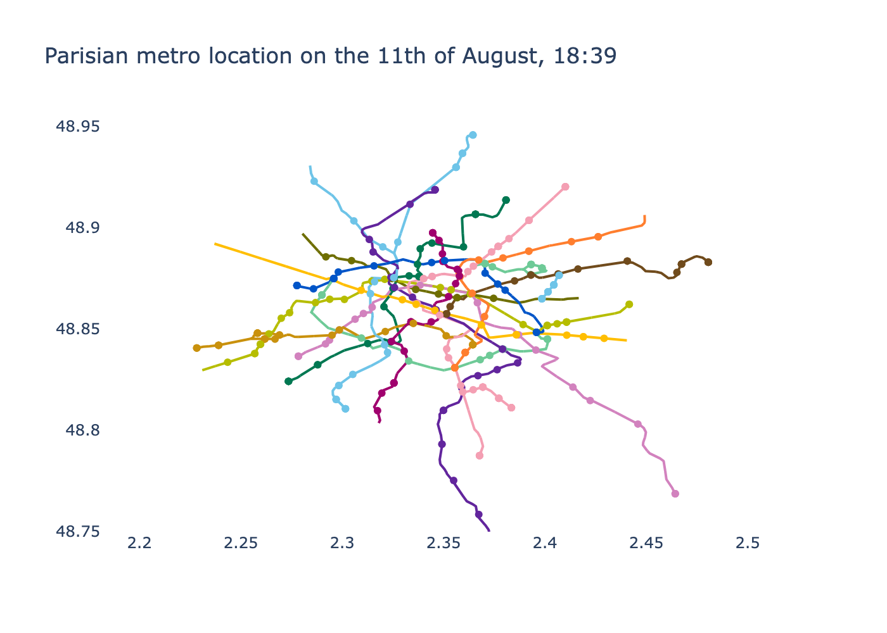

RATP, the parisian transportation company gives in [open data](https://data.iledefrance-mobilites.fr/) details about live traffic, including at what time arrives the next train at each station.

Because there is no exact localisation of the metro, we could infer the exact position of each metro by:
- computing the average duration and distance between each pair of consecutive stations
- infer from the next train arrival time and destination where is located the train in the tunnel.

For now, the location of metros is approximated by the position of the next station it's coming to.

##### Live metro location
<!-- <iframe src="metro_map.html" width="8000" ></iframe> -->
