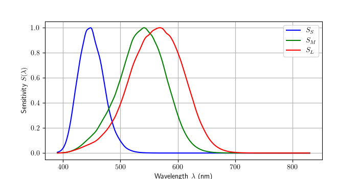

## Introduction

Once I read on the internet that the color pink didn't really exist, and I struggled to really accept this idea. This was the motivation into diving more in our understanding the human perception of colors. 

### Cones 

The perception of light is due to photoreceptors cells, called cone and rod cells. Rod cells gives low intensity light perception, and cones cells gives high intensity light perception. Most humans have three kinds of cones, each sensitive to a different spectrum of lights, and the combination of those three signals analyzed by our brain gives the sensation of light.

From data collected from http://cvrl.ucl.ac.uk/cones.htm , we can plot the different sensitivy of those three cones, sensitives to either small ($S_S$), medium ($S_M$) or long ($S_L$) wavelenghts.

##### Figure 1 : Normalized cone sensitivy to light 

#### Cones responses to any light spectrums

For each wavelength $\lambda$, the contribution to the cone's response is the product of the light's intensity $I(\lambda)$ and the cone's sensitivity $S(\lambda)$ at that wavelength.

Mathematically: $R = \int I(\lambda) S(\lambda) \, d\lambda$, where:
+ $R$ is the total cone response,
+ $I(\lambda)$ is the intensity of the light at wavelength $\lambda$,
+ $S(\lambda)$ is the sensitivity of the cone to that wavelength.

If the light consists of discrete wavelengths (e.g., lasers or narrowband sources), you can sum the contributions from each wavelength:

$$ R = \sum_{i} I(\lambda_i) S(\lambda_i),$$

where $I(\lambda_i)$ and $S(\lambda_i)$ are the intensity and sensitivity at each discrete wavelength $\lambda_i$.

### The space possible cone responses

Because the sensitivy curve overlap according the wavelength values, not all possible triplets $\{S_S(I(\lambda)), S_M(I(\lambda)), S_L(I(\lambda))\}$. 

##### Figure 2 : Response to monochromatic stimulus

First let's inspect all possibles cones responses to monochromatic stimulation. We can plot on a 3D axis the values $\{S_S(\lambda), S_M(\lambda), S_L(\lambda)\}$ with $\lambda \in \[ 400 nm, 800 nm\]$.

##### Figure 3 : The set of possible triplets of responses to monochromatic stimulus

For every monochromatic lights stimulation of intensity $1$,

---

## Part 1
