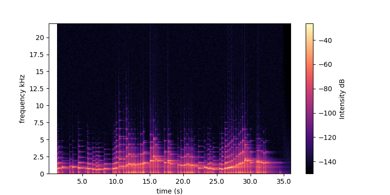
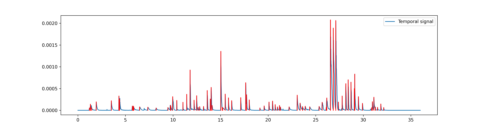
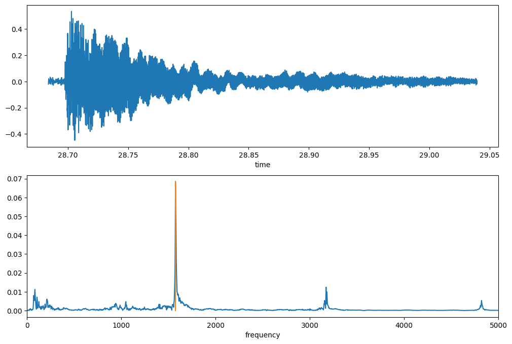

## Introduction

##### Figure 1 : 

From the spectrogram, we can compute a smoothest version of the temporal signal which makes the detection of the note easy by a *scipy* function *detect_peaks*.

##### Figure 2 : 

Then we can apply for each interval apply a fast fourier transform to find which frequencies are present in this temporal signal. Then we can detect again the peaks and choose the highests as being the main harmonic. 

##### Figure 3 : (Top) The extracted temporal signal corresponding to a note detected in the song. (Bottom) The corresponding Fourier transform of the signal. The highest peak is detected at $f=1575$. The other two peaks at higher frequencies correpond to the higher harmonics $2f* and $3f$.

---

## Compute the note from the frequency

From a first note A defined by the frequency $f_0 = 440$Hz, the other notes are defined by:

$$ f_i = f_0 \sqrt[12]{2}^i $$

By the way, this definition is called *twelve-tone equal temperament* and  makes sure that $f_{i+12} = 2f_i$, and that $f_{i+1} = af_{i}$ (with $a=\sqrt[12]{2}$).

We can inverse this formula, and find back which note $i$ is defined by frequency $f$:

$$ i = round(12 \log_2(\frac{f}{440})) $$

---

## Part 1

This section reviews things. Lorem ipsum dolor sit amet, consectetur adipisicing elit, sed do eiusmod tempor incididunt ut labore et dolore magna aliqua. Ut enim ad minim veniam, quis nostrud exercitation ullamco laboris nisi ut aliquip ex ea commodo
consequat. Duis aute irure dolor in reprehenderit in voluptate velit esse
cillum dolore eu fugiat nulla pariatur.

##### Lecture videos

1. [Video Title 1](https://youtu.be/X_mwtm3inEw) ([notes](notes1.pdf))
2. [Video Title 2](https://youtu.be/cFdwOwY2l-A) ([notes](notes2.pdf))

##### Readings

+ [Paper Title 3](https://doi.org/10.1162/rest_a_00893) – This paper finds things.
+ [Paper Title 4](https://doi.org/10.1073/pnas.1816454115) – This survey reviews things.

##### Homework

+ [Quiz 1](quiz3.pdf)
+ [Problem set 1](ps3.pdf)

---

## Part 2

This section introduces other things. Lorem ipsum dolor sit amet, consectetur adipisicing elit, sed do eiusmod tempor incididunt ut labore et dolore magna aliqua. Ut enim ad minim veniam, quis nostrud exercitation ullamco laboris nisi ut aliquip ex ea commodo
consequat. Duis aute irure dolor in reprehenderit in voluptate velit esse
cillum dolore eu fugiat nulla pariatur. Excepteur sint occaecat cupidatat non
proident, sunt in culpa qui officia deserunt mollit anim id est laborum.

##### Lecture videos

3. [Video Title 3](https://youtu.be/ZgYtFURIu4A) ([notes](notes3.pdf))
4. [Video Title 4](https://youtu.be/6j2Debc6LcI) ([notes](notes4.pdf))

##### Readings

+ [Paper Title 5](https://doi.org/10.1257/pol.20150088) – This paper shows stuff.
+ [Paper Title 6](https://doi.org/10.1257/pol.20160462) – This paper shows other things.

##### Homework

+ [Quiz 2](quiz4.pdf)
+ [Problem Set 2](ps4.pdf)

---

## Part 3

This section turns to new things. Lorem ipsum dolor sit amet, consectetur adipisicing elit, sed do eiusmod tempor incididunt ut labore et dolore magna aliqua. Ut enim ad minim veniam, quis nostrud exercitation ullamco laboris nisi ut aliquip ex ea commodo
consequat. Duis aute irure dolor in reprehenderit in voluptate velit esse
cillum dolore eu fugiat nulla pariatur. Excepteur sint occaecat cupidatat non
proident, sunt in culpa qui officia deserunt mollit anim id est laborum.

##### Lecture slides

1. [Lecture Title 1](slides1.pdf)
2. [Lecture Title 2](slides2.pdf)

---

## Part 4

This section turns to other things. Lorem ipsum dolor sit amet, consectetur adipisicing elit, sed do eiusmod tempor incididunt ut labore et dolore magna aliqua. Ut enim ad minim veniam, quis nostrud exercitation ullamco laboris nisi ut aliquip ex ea commodo
consequat. Duis aute irure dolor in reprehenderit in voluptate velit esse
cillum dolore eu fugiat nulla pariatur. Excepteur sint occaecat cupidatat non
proident, sunt in culpa qui officia deserunt mollit anim id est laborum.

##### Lecture slides

3. [Lecture Title 3](slides3.pdf)
4. [Lecture Title 4](slides4.pdf)

---

## Part 5

This section covers even more things. Lorem ipsum dolor sit amet, consectetur adipisicing elit, sed do eiusmod tempor incididunt ut labore et dolore magna aliqua. Ut enim ad minim veniam, quis nostrud exercitation ullamco laboris nisi ut aliquip ex ea commodo
consequat. Duis aute irure dolor in reprehenderit in voluptate velit esse
cillum dolore eu fugiat nulla pariatur. Excepteur sint occaecat cupidatat non
proident, sunt in culpa qui officia deserunt mollit anim id est laborum.