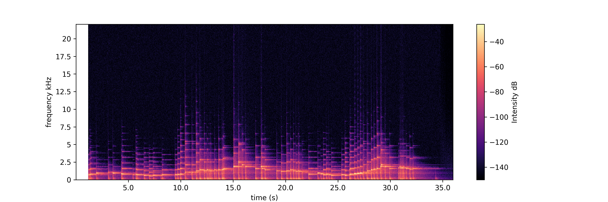

Inspired from my signal analysis teacher, also passionate about music (he is also a oboe player), I wanted to code a simple algorithm to analyze the note in a music piece. The pitch of each note is defined by a frequency $f$. For example, a 440 diapason gives a reference which is A at frequency $440$Hz. Fourier decomposition is a very efficient mathematical tool: it shows the different frequencies present in a signal. We suppose that we record an instrument, like a piano, where different notes are played consecutively. 

We suppose that each note are played on a *twelve-tone equal temperament* keyboard. That means that the octave is divided into 12 parts which are equally spaced on a logarithmic scale. 

##### Figure 1 : 12-tone equal temperament chromatic scale on C


From a first note A defined by the frequency $f_0 = 440$Hz, the other notes are defined by:

$$ f_i = f_0 \sqrt[12]{2}^i $$


My method works in three steps: 
- smooth the temporal signal in order to detect the timestamps of the notes
- apply Fourier transform to each note individually
- find the fundamental frequency and convert it to a note. 

## Introduction

##### Figure 1 : 



```
# Import functions
import numpy as np
import matplotlib.pyplot as plt
from scipy.fft import fft, ifft, fftfreq
from scipy.signal import spectrogram, find_peaks

# Compute the spectrogram and sum
f, t, Sxx = spectrogram(y, fs, nperseg=2**9)
enveloppe = Sxx.sum(axis=0)

# Detect the timestamps of the note
ind, descr = find_peaks(enveloppe, width=1, height=5e-5)

# Plot
plt.figure(figsize=(15,4))
plt.plot(t, enveloppe, label='Temporal signal') # temporal signal
for num_i,i in enumerate(ind): # the peaks
    plt.plot([t[i],t[i]], [0,descr['peak_heights'][num_i]], c='red')
plt.show()
```

From the spectrogram, we can compute a smoothest version of the temporal signal which makes the detection of the note easy by a *scipy* function *detect_peaks*.

##### Figure 2 : 


Then we can apply for each interval apply a fast fourier transform to find which frequencies are present in this temporal signal. Then we can detect again the peaks and choose the highests as being the main harmonic. 

##### Figure 3 : (Top) The extracted temporal signal corresponding to a note detected in the song. (Bottom) The corresponding Fourier transform of the signal. The highest peak is detected at $f=1575$. The other two peaks at higher frequencies correspond to the higher harmonics $2f$ and $3f$.


```
# Enumerate trough the peaks (the detected notes)
for num_i,i in enumerate(ind):
    t_min, t_max = t[descr['left_bases'][num_i]], t[descr['right_bases'][num_i]]
    if t_max-t_min<2: # check that the one is shorter than 2 secs

        # Subset 
        small_t, small_y = t_axis[(t_axis>=t_min)&(t_axis<=t_max)], \
            y[(t_axis>=t_min)&(t_axis<=t_max)]
        
        # FFT
        N = len(small_t)
        yf = fft(small_y)
        yf = 2.0/N * np.abs(yf[0:N//2])
        xf = fftfreq(N, 1/fs)[:N//2]

        # Detect the peaks in the spectrum
        peaks, _ = find_peaks(yf, distance=10, width=1)

        # Choose the highest peak
        index_maxi = np.argsort(yf[peaks])[-1]
        f = xf[peaks[index_maxi]]
        index_note = quantize_f_to_note(f)
        print(f, index_note, liste_notes_letter[index_note%12])
```

```
liste_notes_letter = ["A", "A#", "B", "C", "C#", "D", "D#", "E", "F", "F#", "G", "G#"]
```

---

## Compute the note from the frequency

From a first note A defined by the frequency $f_0 = 440$Hz, the other notes are defined by:

$$ f_i = f_0 \sqrt[12]{2}^i $$

By the way, this definition is called *twelve-tone equal temperament* and  makes sure that $f_{i+12} = 2f_i$, and that $f_{i+1} = af_{i}$ (with $a=\sqrt[12]{2}$).

We can inverse this formula, and find back which note $i$ is defined by frequency $f$:

$$ i = round(12 \log_2(\frac{f}{440})) $$

```
def quantize_f_to_note(f):
  # Input frequency f (Hz)
  # Ouput integer. 0 is A 440Hz, -1 is the Ab under, and 1 is A# above.
  return(np.round(12*np.log(f/440)/np.log(2)).astype(int))
```

---

## Part 1

This section reviews things. Lorem ipsum dolor sit amet, consectetur adipisicing elit, sed do eiusmod tempor incididunt ut labore et dolore magna aliqua. Ut enim ad minim veniam, quis nostrud exercitation ullamco laboris nisi ut aliquip ex ea commodo
consequat. Duis aute irure dolor in reprehenderit in voluptate velit esse
cillum dolore eu fugiat nulla pariatur.

##### Lecture videos

1. [Video Title 1](https://youtu.be/X_mwtm3inEw) ([notes](notes1.pdf))
2. [Video Title 2](https://youtu.be/cFdwOwY2l-A) ([notes](notes2.pdf))

##### Readings

+ [Paper Title 3](https://doi.org/10.1162/rest_a_00893) – This paper finds things.
+ [Paper Title 4](https://doi.org/10.1073/pnas.1816454115) – This survey reviews things.

##### Homework

+ [Quiz 1](quiz3.pdf)
+ [Problem set 1](ps3.pdf)

---

## Part 2

This section introduces other things. Lorem ipsum dolor sit amet, consectetur adipisicing elit, sed do eiusmod tempor incididunt ut labore et dolore magna aliqua. Ut enim ad minim veniam, quis nostrud exercitation ullamco laboris nisi ut aliquip ex ea commodo
consequat. Duis aute irure dolor in reprehenderit in voluptate velit esse
cillum dolore eu fugiat nulla pariatur. Excepteur sint occaecat cupidatat non
proident, sunt in culpa qui officia deserunt mollit anim id est laborum.

##### Lecture videos

3. [Video Title 3](https://youtu.be/ZgYtFURIu4A) ([notes](notes3.pdf))
4. [Video Title 4](https://youtu.be/6j2Debc6LcI) ([notes](notes4.pdf))

##### Readings

+ [Paper Title 5](https://doi.org/10.1257/pol.20150088) – This paper shows stuff.
+ [Paper Title 6](https://doi.org/10.1257/pol.20160462) – This paper shows other things.

##### Homework

+ [Quiz 2](quiz4.pdf)
+ [Problem Set 2](ps4.pdf)

---

## Part 3

This section turns to new things. Lorem ipsum dolor sit amet, consectetur adipisicing elit, sed do eiusmod tempor incididunt ut labore et dolore magna aliqua. Ut enim ad minim veniam, quis nostrud exercitation ullamco laboris nisi ut aliquip ex ea commodo
consequat. Duis aute irure dolor in reprehenderit in voluptate velit esse
cillum dolore eu fugiat nulla pariatur. Excepteur sint occaecat cupidatat non
proident, sunt in culpa qui officia deserunt mollit anim id est laborum.

##### Lecture slides

1. [Lecture Title 1](slides1.pdf)
2. [Lecture Title 2](slides2.pdf)

---

## Part 4

This section turns to other things. Lorem ipsum dolor sit amet, consectetur adipisicing elit, sed do eiusmod tempor incididunt ut labore et dolore magna aliqua. Ut enim ad minim veniam, quis nostrud exercitation ullamco laboris nisi ut aliquip ex ea commodo
consequat. Duis aute irure dolor in reprehenderit in voluptate velit esse
cillum dolore eu fugiat nulla pariatur. Excepteur sint occaecat cupidatat non
proident, sunt in culpa qui officia deserunt mollit anim id est laborum.

##### Lecture slides

3. [Lecture Title 3](slides3.pdf)
4. [Lecture Title 4](slides4.pdf)

---

## Part 5

This section covers even more things. Lorem ipsum dolor sit amet, consectetur adipisicing elit, sed do eiusmod tempor incididunt ut labore et dolore magna aliqua. Ut enim ad minim veniam, quis nostrud exercitation ullamco laboris nisi ut aliquip ex ea commodo
consequat. Duis aute irure dolor in reprehenderit in voluptate velit esse
cillum dolore eu fugiat nulla pariatur. Excepteur sint occaecat cupidatat non
proident, sunt in culpa qui officia deserunt mollit anim id est laborum.