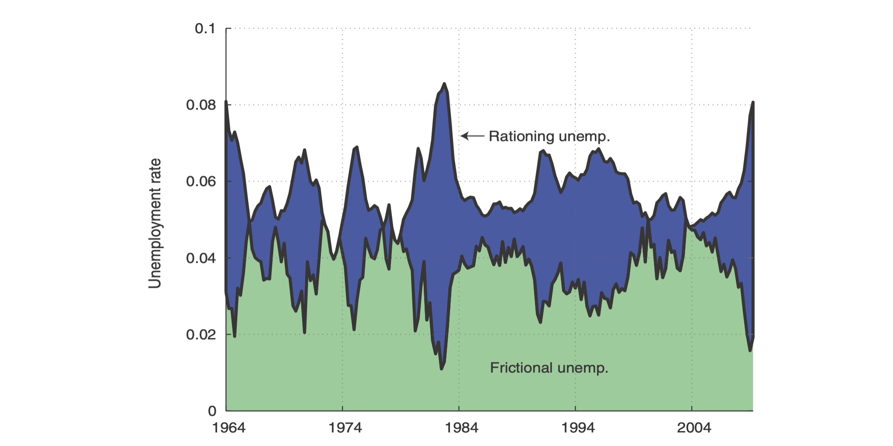

---

##### Download

+ [Paper](paper1.pdf)
+ [Online appendix](appendix1.pdf)
+ [Code and data](https://github.com/pmichaillat/job-rationing)

---

##### Abstract

This paper proposes an algorithm which allows Alice to simulate the game played between her and Eve. Under the condition that the set of detectors that Alice assumes Eve to have is sufficiently rich (e.g. CNNs), and that she has an algorithm enabling to avoid detection by a single classifier (e.g adversarial embedding, gibbs sampler, dynamic STCs), the proposed algorithm converges to an efficient steganographic algorithm. This is possible by using a $\min\max$ strategy which consists at each iteration in selecting the least detectable stego image for the best classifier among the set of Eve's learned classifiers. The algorithm is extensively evaluated and compared to prior arts and results show the potential to increase the practical security of classical steganographic methods. For example the error probability $P_{err}$ of SRNet on detecting stego images with payload of 0.4 bpnzAC embedded by J-Uniward and QF 75 starts at 7.1\% and is increased by +13.6\% to reach 20.7\% after eight iterations. For the same embedding rate and for QF 95, undetectability by XU-Net with J-Uniward embedding is 23.4\%, and it jumps by +25.8\% to reach 49.2\% at iteration 3.

---

##### Figure X: Figure caption



---

##### Citation

Author. Year. "Title." *Journal* Volume (Issue): First page–Last page. https://doi.org/paper_doi.

```BibTeX
@article{AAYY,
author = {Author},
doi = {paper_doi},
journal = {Journal},
number = {Issue},
pages = {XXX--YYY},
title ={Title},
volume = {Volume},
year = {Year}}
```

---

##### Related material

+ [Presentation slides](presentation1.pdf)
+ [Dissertation title](https://escholarship.org/uc/item/7jr3m96r) – PhD dissertation on which this paper is based.
+ [Column title](https://cep.lse.ac.uk/pubs/download/cp365.pdf) – Nontechnical column describing the paper.

