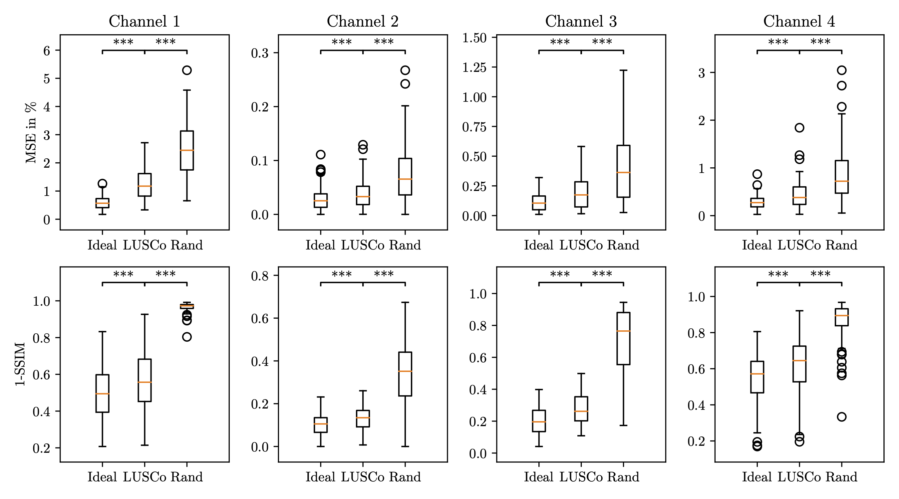

<!-- 
---

##### Download

+ [Paper](paper2.pdf)
+ [Online appendix](appendix2.pdf)
+ [Code and data](https://github.com/pmichaillat/unemployment-gap) -->

---

# SMLM

Studying via Single Molecule Localization Microscopy (SMLM) the interactions between distinct molecular structures within cells requires the visualization of multiple molecular targets in the same sample. But simultaneous multicolour SMLM comes with technical difficulties. Here, we propose a computational approach to recolor SMLM images of distinct molecular structures labeled with the same dye and imaged simultaneously. We demonstrate the approach on composite image of five different structures.

SMLM allows to probe intricate cellular structures at near molecular resolution. Studying the interactions between distinct molecular structures within cells requires the super-resolution visualization of multiple molecular targets in the same sample. Multicolour SMLM based on photoswitchable dyes typically employs fluorescent dyes with distinct spectra to label distinct molecular species. However this method is generally limited to 2-4 colours because of spectral overlaps and differences in blinking efficiencies, requires careful registration and is prone to chromatic aberrations. Sequential DNA-PAINT allows multicolour imaging of many different molecular species with the same dyes but necessitates washing steps in between imaging cycles and requires long acquisition times. 

# LUSCo

To overcome those problems, we propose a computational approach to generate multicolour images from SMLM data of distinct molecular structures labeled with the same dye and imaged simultaneously. The central principle underpinning this study pertains to the deep learning model's ability to assimilate spatial patterns of distinct molecules, facilitating their discrimination. To achieve this, the model necessitates a training process using a dataset of both monochromatic and multichromatic images, such as the model learns to recolor monochromatic images thanks to the ground truth multicolor version of it. It is why we curated a synthetic dataset comprising superimposed, independently acquired SMLM images. The artificial superimposition of these images provides us with both monochromatic (obtained by summing the superimposed images) and multichromatic versions. Then we demonstrate the approach on bicolor images  data and show preliminary results on experimental data including microtubules and nuclear pores. Our approach provides an alternative route towards imaging many molecular structures in the same cells at high resolution with a single fluorescent dye.

(a)Training: In this phase, the methodology involves the acquisition of n (here $n=3$) monochromatic, independent images (a.1). These images are then combined to generate a synthetic monochromatic image (a.2). This synthetic image is subsequently input into a deep learning auto-encoder, which performs the unmixing process and produces a multi-channel image (a.3), which is compared for learning to the ground-truth n-channel image (a.1). (b) Testing: During testing, (b.1) a single-color multi-structure image is input into the pre-trained network. The network then processes this image and once again produces an n-channel image as output in (b.2). (c) Example of the output of network $\mathcal{G}$ trained on synthetic overlap of real images of microtubules, nuclear pore complexes and mitochondria. (d) Results of distribution of metric D, where D=MSE (left column) and D=1-SSIM (middle column). The performance of $\mathcal{G}$ is evaluated by comparing the distribution of $D(\mathcal{G}(x), y)$  to the reference distribution of $D(x, y)$  and random distribution of $D(perm(x), perm(y))$. On the right, the distribution of overlap between three channels are compared.

##### Related material

+ [Poster](Poster___SMLM_conference.pdf)

