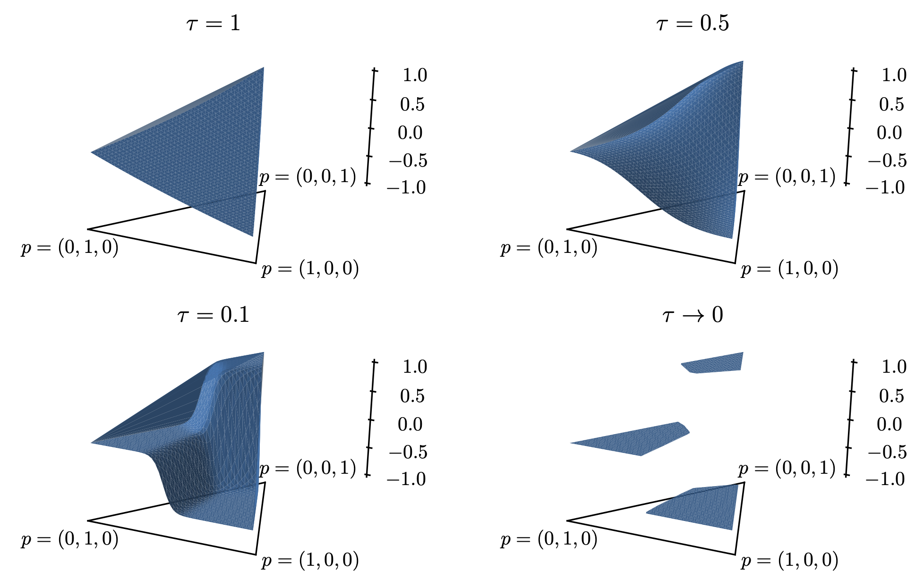

---

##### Download

+ [Paper](backpack.pdf)
<!-- + [Online appendix](appendix1.pdf) -->
+ [Code and data](https://gitlab.univ-lille.fr/solene.bernard/backpack)

---

##### Abstract

A minmax protocol offers a general method to automatically optimize steganographic algorithm against a wide class of steganalytic detectors. The quality of the resulting steganograhic algorithm depends on the ability to find an “adversarial” stego image undetectable by a set of detectors while communicating a given message. Despite minmax protocol instantiated with ADV-EMB scheme leading to unexpectedly good results, we show it suffers a significant flaw and we present a theoretically sound solution called Backpack. Extensive experimental verification of minmax protocol with Backpack shows superior performance to ADV-EMB, the generality of the tool by targeting a new JPEG QF100 compatibility attack and further improves the security of steganographic algorithms.

---

## Differentiable steganography

The idea we propose is to optimize the cost $\rho$ w.r.t. the detectability of a detector $f$ by a standard optimization. We will use gradient descent on the costs in order to decrease
$f(y)$. In the usual gradient descent setting, we need to compute the gradient $\nabla_{\boldsymbol{\rho}} \mathbb{E}[f(\mathbf{y})]$, and for a given  $\boldsymbol{\rho}$, we would update it by the following formula

$$\boldsymbol{\rho} \leftarrow \boldsymbol{\rho} - \alpha \nabla_\rho \mathbb{E}_{\mathbf{b} ~ P_{\mathbf{b}}(. \mid \boldsymbol{\rho}, \lambda)}[f(\mathbf{x}+\mathbf{b})]$$


### Softmax Gumbel
Calculating the gradient of the expectation of a discrete probability distribution with respect to its parameters is a very well-studied problem. From the vast prior art, we have chosen the method relying on the Gumbel distribution. This technique has the advantage
of giving a general formula to draw samples according to any discrete distribution so that it can be used without a modification for n-ary coding, and its theoretical properties
are well analyzed. It can be shown that discrete modifications can be drawn by sampling $g = (g^j)_{j\in B}$, which is a vector of independent entries sampled from the standard Gumbel distribution G(0, 1), and applying the following deterministic function:

$$b=HG(\boldsymbol{\pi}, \mathbf{g})=\underset{i \in \mathcal{R}}{\arg \max }\left(g^j+\log \pi^j\right)$$

In the above function $HG$ (called Hardmax Gumbel), the $\arg \max$ can be conveniently replaced by the softmax function:

$$\operatorname{softmax}\left(v^1, \ldots, v^n\right)=\frac{1}{\sum_{k=1}^n e^{v^k}}\left(e^{v^1}, \ldots, e^{v^n}\right)$$

which is a well-known approximation of arg max, as can be seen from 

$$\lim _{\tau \rightarrow 0} \operatorname{softmax}\left(\frac{v^1}{\tau}, \ldots, \frac{v^n}{\tau}\right)=(0,0 \ldots, 0,1,0, \ldots, 0)$$

where the $1$ is on $\arg\max_i v^i$ position and $\tau$ is a temperature parameter controlling the smoothness of the approximation.

Replacing arg max in Equation by a softmax approximation with temperature leads to 

$$\tilde{b}_\tau = SG_\tau(\boldsymbol{\pi}, \mathbf{g})=\sum_{j \in \mathcal{B}} j \nu^j \text { with } \boldsymbol{\nu}=softmax\left(\frac{\mathbf{g}+\log \boldsymbol{\pi}}{\tau}\right)$$

The gradient of the continuous modification $\tilde{b}_\tau$ w.r.t. $\pi$ are
easy to compute and have non-zero values. It can be conveniently plugged in the chain rule although the resulting gradient is biased when $\tau > 0$. Figure below offers a visualization of the influence of $tau$ on the output of the Softmax-Gumbel (SG) function, for a fixed realization of a random vector g and fixed probability vector $\pi$.

See on the Figure below the different function $b_{\tau}$ for different $\tau$. For a given value of triplet $g = (g^{−1}, g^{0}, g^{+1})$ (where $g^j ∼ G(0, 1)$ are independently drawn from Gumbel standard distribution), the value of the modification $\tilde{b}_{\tau} = SG(p, g)$ is plotted the z-axis for all possible triplets of probabilities $p = (p^{−1}, p^{0}, g^{+1})$, and for 4 values of $\tau$ . The triplets are plotted in the trilinear coordinate system.

##### Softmax Gumbel function 


#### Pseudo code for the proposed procedure


---

## Backpack: BACKPropagable attACK


---

##### Citation

Solène Bernard, Patrick Bas, John Klein, Tomas Pevny. 2022. "Backpack: A Backpropagable Adversarial Embedding Scheme." *IEEE Transactions on Information Forensics and Security* Volume (17): 3539 - 3554. https://doi.org/10.1109/TIFS.2022.3204218

```BibTeX
@ARTICLE{9891839,
  author={Bernard, Solène and Bas, Patrick and Klein, John and Pevný, Tomáš},
  journal={IEEE Transactions on Information Forensics and Security}, 
  title={Backpack: A Backpropagable Adversarial Embedding Scheme}, 
  year={2022},
  volume={17},
  number={},
  pages={3539-3554},
  keywords={Protocols;Detectors;Games;Costs;Steganography;Security;Distortion;Steganography;steganalysis;distortion function;adversarial attacks},
  doi={10.1109/TIFS.2022.3204218}}
```

## Results


<!-- 
---

##### Related material

+ [Presentation slides](presentation1.pdf)
+ [Dissertation title](https://escholarship.org/uc/item/7jr3m96r) – PhD dissertation on which this paper is based.
+ [Column title](https://cep.lse.ac.uk/pubs/download/cp365.pdf) – Nontechnical column describing the paper. -->

