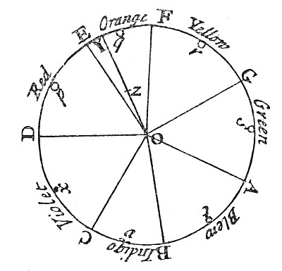
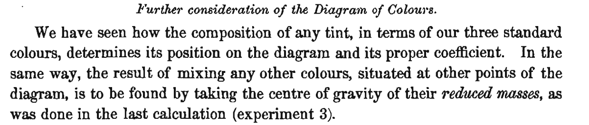
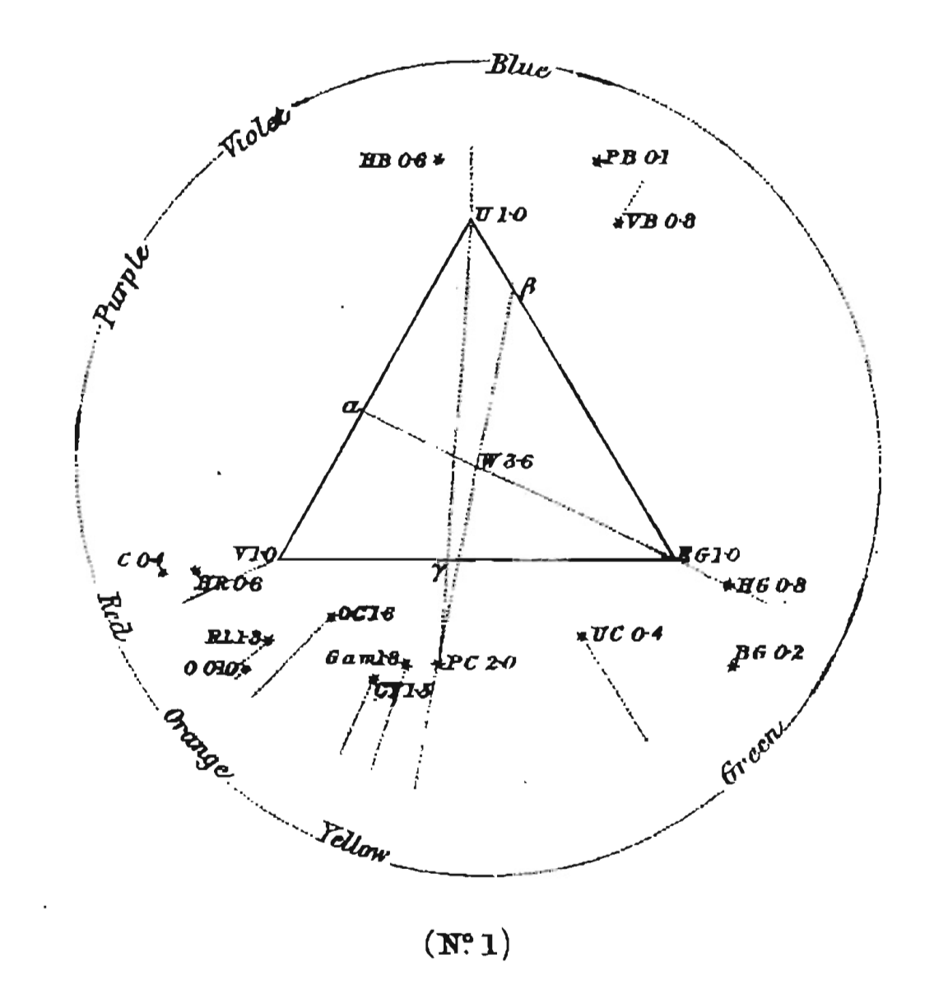
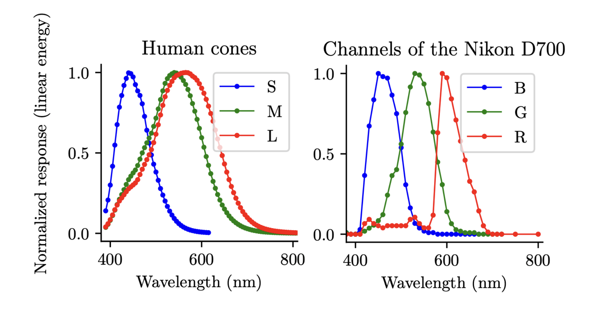
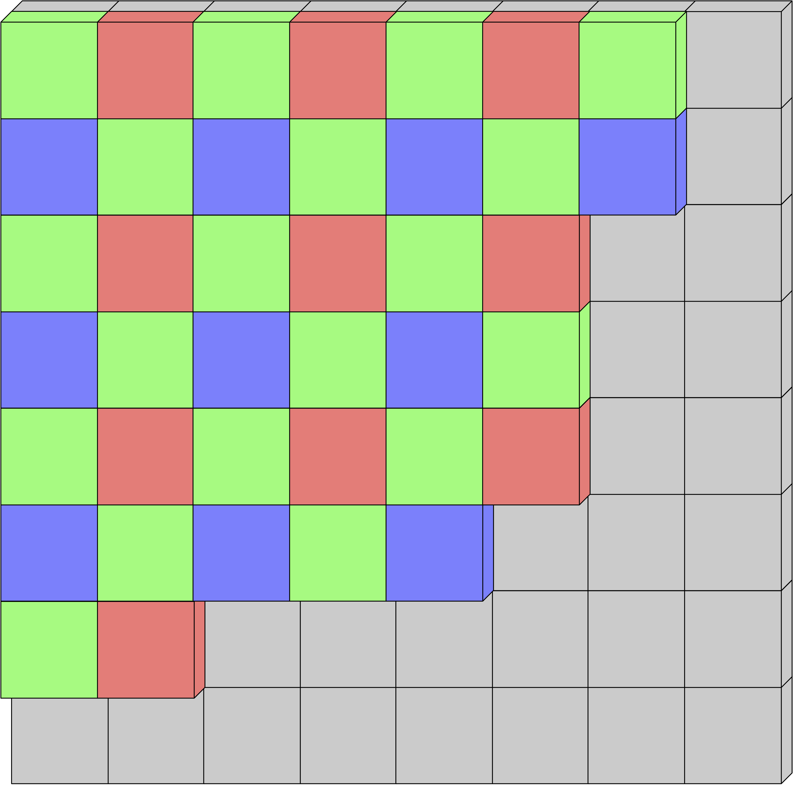

Photography, etymologically meaning ‘writing with light,’ involves the objective capture and translation of the spatial and spectral properties of light— which produce visual sensations in humans—into a permanent physical representation.

This technique is more than standard today, as it is part of our daily lives as all of our smartphones can take pictures. However, until the last century, photography was not ordinary, requiring considerable technological and scientific progress.

## A brief history of colour theory

### Newton's pioneer work

[Isaac Newton’s work](https://www.gutenberg.org/files/33504/33504-h/33504-h.htm "Opticks") on colour was groundbreaking in the 17th century — he was the first to show, through systematic experiments, that white light is composed of many different colours, and that colours are a property of light itself, not of objects. Newton devised one of the first colour circles, arranging spectral colours around a wheel and showing that mixing certain pairs (e.g., red and blue) could produce others (e.g., purple), which do not appear in the spectrum. He's the first to represent colours on a wheel, which is still today the representation mainly used.

##### The first colour wheel: Newton's colour circle

### Young's speculation on the biology of the eye

It is in [1802 that Young boldly claimed](https://www.jstor.org/stable/pdf/107113.pdf "The Bakerian Lecture: On the Theory of Light and Colours") that it exists three types of photoreceptors (now known as cone cells) in the human eye, which he named *point of the retina*, each of which are sensitive to a particular range of visible light, which are today called named short, medium, or large given their size. It came as a speculation following Newton’s work, and although Young did not experimentally verify it, it is remarkable that later discoveries proved him correct. Young wrote in *The Bakerian Lecture: On the Theory of Light and Colours*:

> Now, as it is almost impossible to conceive each sensitive point of the retina to contain an infinite number of particles each capable of vibrating in perfect unison with every possible undulation, it becomes necessary to suppose the number limited, for instance, to the three principal colours, red, yellow, and blue, of which the undulations are related in magnitude nearly as the numbers 8, 7, and 6.

### Maxwell's experiment and first photography protocol

A few years later, inspired from Young's work, [Maxwell demonstrated theoretically in 1855](https://www.jimworthey.com/archive/Maxwell_1855_OCRtext.pdf "Experiments on colour, as perceived by the eye.") that any monochromatic light stimulating three receptors should be able to be equally stimulated by a set of three different monochromatic lights. 

##### Quote from *Experiments on colour, as perceived by the eye*.

Inspired by [Mayer and Young's triangle](http://www.gutenberg-e.org/lowengard/C_Chap55.html "Tobias Mayer's Color Algebra"), he formalized he statement by showing that he can reproduce the sensation of any colour by combining with different factors three colors U,V, and EG which stands for Ultramarine, Vermilion and Emerald Green, represented at the angles of an equilateral triangle. Any colour compounded of these three is to be represented by a point found by conceiving masses proportional to the several components of the colour placed at their respective angular points, and taking the centre of gravity of the three masses.

##### Maxwell's triangle, where U,V and EG.

This would mean that a superposition of three colours could reproduce every sensation of colour. Therefore, the first colour photography was produced by following Maxwell's protocol, by taking pictures three times of the same scene with three coloured filters.

##### The first color photograph made by the three-color method suggested by James Clerk Maxwell in 1855, taken in 1861 by Thomas Sutton. The subject is a colored ribbon, usually described as a tartan ribbon.

## Digital colour photography

Today, the representation of colour digital images still relies on the superposition of three colour channels: red, green, and blue, so three types of sensors are used. Figure below shows both absorption spectrums of receptors in the eye and in a Nikon D700 camera look alike.

##### Normalized response of the three cones S, M, L of the human eye (left) and of the three color channels of a Nikon D700 device (right).

In order to take at one instant a picture with three kinds of photoreceptors, the most common solution is to use a colour filter array (CFA). It is a mosaic of tiny colour filters placed over the pixel sensors of an image sensor to capture colour information. Multiple subjective designs of the CFA exist. The most popular one is the Bayer Filter, plotted below.

##### The Bayer CFA. Each two-by-two submosaic contains 2 green, 1 blue, and 1 red filter, each filter covering one pixel sensor.

The raw image data captured by the image sensor is then converted to a full-colour image (with intensities of all three primary colours represented at each pixel) by a demosaicing algorithm which is tailored for each type of colour filter. Demosaicing consists in interpolating the missing colour values for each pixel from the information captured by neighbouring pixels on the sensor’s colour filter array.

From Newton’s prism to Maxwell’s tartan ribbon, the science of colour has shaped today’s cameras, which still build every image from just three colours: red, green, and blue.