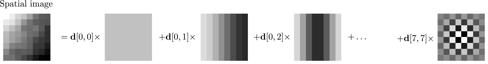
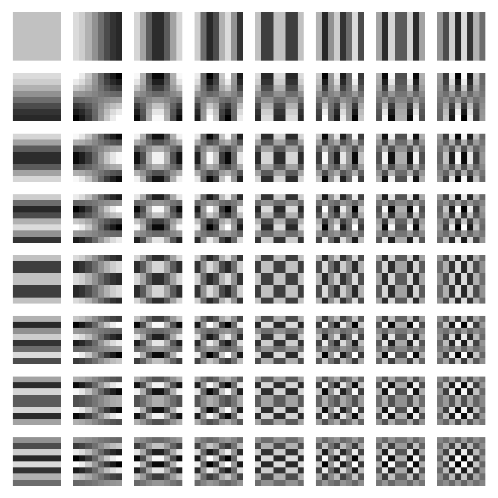
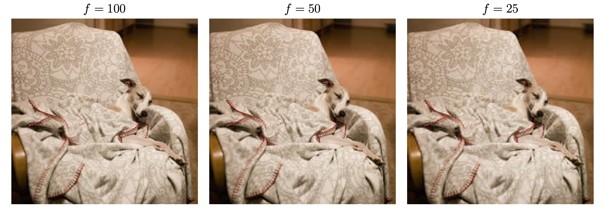

The pioneering work of Joseph Fourier in the early 19th century on representing functions as sums of sinusoidal components (now formalized as the Fourier transform), has become a fundamental tool across scientific and engineering disciplines. Fourier analysis allows signals to be expressed in the frequency domain, facilitating efficient manipulation and interpretation of data. I also used the results of his research for the music analysis algorithm in the blog section!

In digital image processing, this principle underpins compression algorithms such as JPEG, which rely on transforming spatial pixel data into frequency components to exploit redundancies and perceptual limitations of the human visual system. By isolating and quantifying the image’s frequency content, JPEG compression selectively reduces or eliminates high-frequency details that are less perceptible, achieving significant data reduction while maintaining visual fidelity.

## Discrete Cosinus Transform
The most famous compression algorithm JPEG was motivated by the challenge of finding a new representation of images where the content of images can be represented in fewer features than the number of pixels in the image. It relies on the Discrete Cosinus Transform (DCT) proposed by Nasir Ahmed in 1972 which is derived from the Discrete Fourier Transform (DFT).

Any image can be also expressed as a weighted sum of filters, where filters have from low to high frequency. Often, an image is compressed block by block, often of size $8 \times 8$. In the next figure there is an example of an image of $64$ pixels, which is decomposed as a weighted sum of $64$ filters. The weights are called *DCT coefficients*.

##### Decomposition of a 8 × 8 spatial image into a linear combination of 64 DCT filters.

The basis of filters is showed below. Horizontal frequencies increase from left to right (with increasing j), and vertical frequencies increase from top to bottom (with increasing i). The constant-valued basis function at the upper left is often called the DC basis function, and the corresponding DCT coefficient d[0, 0], the DC coefficient.

##### Visualization of the 64 DCT Filters F[i,j], where i is for the row and j for the column. 

## Compression

The first step of JPEG compression is to apply DCT transform to each 8 × 8 (non-overlapping) block of the spatial image.

Then there is a quantization step, which is the step which produces data loss, leading to compression. During quantization, the DCT coefficient $d[i, j]$ is divided by quantization step $q[i, j]$ from the quantization matrix q and then rounded to their closest integers.

The larger are the quantization steps, the fewer bits are needed to code all the image coefficients, but the more the image quality is damaged.

The JPEG standard recommends a set of quantization matrices indexed by a quality factor f which is an integer between 1 and 100. Below an example of an image with different quality factors. The more the quality factor is close to 100, the more the decompressed image is close to the original image. For low-quality factors, artefacts due to 8 × 8 block-wise DCT transform are apparent.

##### Vizualization of effect of image JPEG compression for three quality factors, f = 25, 50 and 100.
<!-- 

 -->

